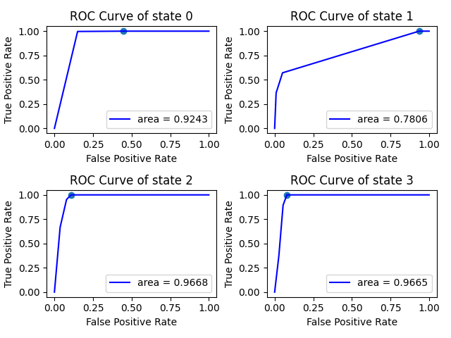
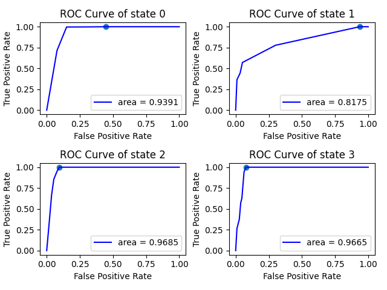
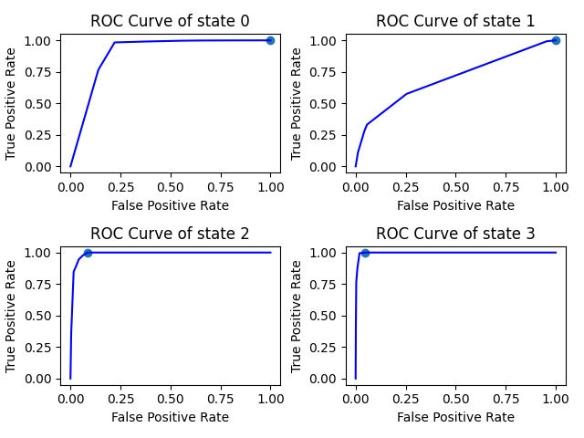

# 2024 Autumn Project on Credit Risk
This is a project aiming at analyzing overdue possibilities of customer credit, using Markov Chain and Neuro Network. Starting from 2024 autumn.

## Works before joining in
Markov Chain model, see first commit of Markov Folder.  
brier score = 0.12729008977196365  
brier score when transition matrix is Identity matrix = 0.23454545454545456  
_** Identity matrix: state transition doesn't happen. The next state copies current state for 100% probability._  
 
If calculate in seperate groups of 'grade' :  
brier score of grade 0 = 0.1961217058296821  
brier score of grade 1 = 0.11666801694743444  

## Week 1 (Oct. 14)
### Tasks
- [x] build multi-class MLPClassifier with scikit-learn, predict on 'y_next'
- [x] Evaluate results on brier score
- [x] Draw ROC curve
### Outcomes
Basic ANN, with current month overdue state 'y' as input(one-hot encoded). Two hidden layers, each with 10 neurons. Output a probability matrix for all states of next month.  
 
Brier score for state 0 is 0.026767212942569212  
Brier score for state 1 is 0.03999608844442646  
Brier score for state 2 is 0.026211268859962226  
Brier score for state 3 is 0.03474007548554805  
**brier score = 0.12771464573250563**  
 
  
Best threshold for state 0 is  0.01  
Best threshold for state 1 is  0.04  
Best threshold for state 2 is  0.06  
Best threshold for state 3 is  0.29  
_** Threshold: If probability for state i > threshold, this is considered as 'positive'. Otherwise 'negative'._ ***Best means we achieve the highest TRF.***  

## Week 2 (Oct. 21)
### Tasks
- [x] include 'grade' to NN
- [x] wait for supervisor sending larger dataset and test again
- [x] test on training dataset
- [ ] try to adjust NN parameters / apply advanced spliting methods
### Outcomes
Result slightly gets worse after including 'grade'.  
 
Brier score for state 0 is 0.026593834862040974  
Brier score for state 1 is 0.03991571728797261  
Brier score for state 2 is 0.02782713063525248  
Brier score for state 3 is 0.03674043336080793  
**brier score = 0.13107711614607478**  
 
  
Best threshold for state 0 is  0.01  
Best threshold for state 1 is  0.04  
Best threshold for state 2 is  0.06  
Best threshold for state 3 is  0.20  
#
Even worse with larger dataset?  
 
Brier score for state 0 is 0.026985053841233005  
Brier score for state 1 is 0.042334845748764234  
Brier score for state 2 is 0.030071927108308014  
Brier score for state 3 is 0.03728453669115795  
**brier score = 0.13667636338945005**  
 
  
Best threshold for state 0 is  0.02  
Best threshold for state 1 is  0.01  
Best threshold for state 2 is  0.09  
Best threshold for state 3 is  0.13  
#
Test on training dataset, worse as expected.  
 
**brier score = 0.19145633429898679**  
**brier score = 0.1411776412452** (larger dataset)