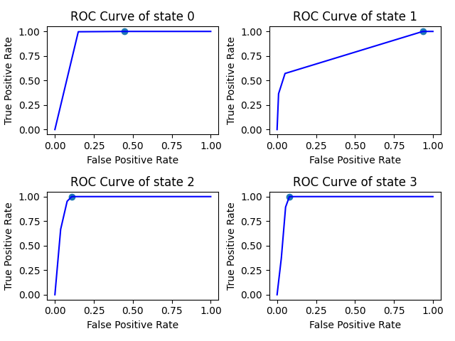
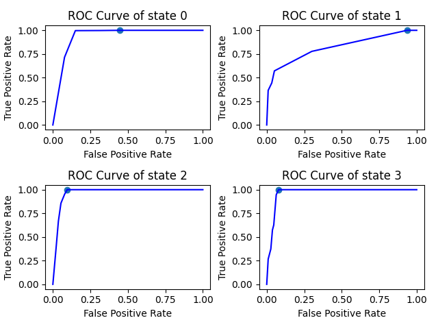

# 2024 Autumn Project on Credit Risk
This is a project aiming at analyzing overdue possibilities of customer credit, using Markov Chain and Neuro Network. Starting from 2024 autumn.

## Works before joining in
Markov Chain model, see first commit of Markov Folder.  
brier score = 0.12729008977196365
brier score when transition matrix is Identity matrix = 0.23454545454545456  
 
_Identity matrix: state transition doesn't happen. The next state copies current state for 100% probability._

## Week 1
### Tasks
- [x] build multi-class MLPClassifier with scikit-learn, predict on 'y_next'
- [x] Evaluate results on brier score
- [x] Draw ROC curve
### Outcomes
Basic ANN, with current month overdue state 'y' as input(one-hot encoded). Two hidden layers, each with 10 neurons. Output a probability matrix for all states of next month.  
 
**brier score = 0.12771464573250563**  
 
  
Best threshold for state 0 is  0.01  
Best threshold for state 1 is  0.04  
Best threshold for state 2 is  0.06  
Best threshold for state 3 is  0.29  
_Threshold: If probability for state i > threshold, this is considered as 'positive'. Otherwise 'negative'._  
 
***Best means we achieve the highest TRF.***  

## Week 2
### Tasks
- [x] include 'grade' to NN
- [ ] test on training dataset
- [ ] wait for supervisor sending larger dataset and test again
- [ ] try to adjust NN parameters / apply advanced spliting methods
### Outcomes
Result slightly gets worse after including 'grade'.  
 
**brier score = 0.13107711614607478**  
 
  
Best threshold for state 0 is  0.01  
Best threshold for state 1 is  0.04  
Best threshold for state 2 is  0.06  
Best threshold for state 3 is  0.20  
