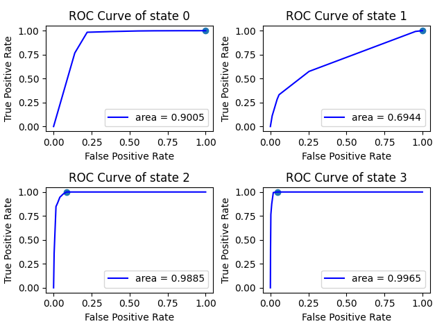

# 2024 Autumn Project on Credit Risk
This is a project aiming at analyzing overdue possibilities of customer credit, using Markov Chain and Neuro Network. Starting from 2024 autumn.

## Works before joining in
Markov Chain model, see first commit of Markov Folder.  
**brier score = 0.12729008977196365**  
brier score when transition matrix is Identity matrix = 0.23454545454545456  
_** Identity matrix: state transition doesn't happen. The next state copies current state for 100% probability._  
 
## Week 1 (Oct. 14)
### Tasks
- [x] Build multi-class MLPClassifier with scikit-learn, predict on 'y_next'
- [x] Evaluate results on brier score
- [x] Draw ROC curve
### Outcomes
Basic ANN, with current month overdue state 'y' as input(one-hot encoded). Two hidden layers, each with 10 neurons. Output a probability matrix for all states of next month.  
 
Brier score for state 0 is 0.026767212942569212  
Brier score for state 1 is 0.03999608844442646  
Brier score for state 2 is 0.026211268859962226  
Brier score for state 3 is 0.03474007548554805  
**brier score = 0.12771464573250563**  
 
  
Best threshold for state 0 is  0.01  
Best threshold for state 1 is  0.04  
Best threshold for state 2 is  0.06  
Best threshold for state 3 is  0.29  
_** Threshold: If probability for state i > threshold, this is considered as 'positive'. Otherwise 'negative'. Best means we achieve the highest TRF._  

## Week 2 (Oct. 21)
### Tasks
- [x] Include 'grade' to NN
- [x] Wait for larger dataset and test again
- [x] Test on training dataset
### Outcomes
Result gets worse after including 'grade'.  
 
Brier score for state 0 is 0.026593834862040974  
Brier score for state 1 is 0.03991571728797261  
Brier score for state 2 is 0.02782713063525248  
Brier score for state 3 is 0.03674043336080793  
brier score = 0.13107711614607478  
 
  
Best threshold for state 0 is  0.01  
Best threshold for state 1 is  0.04  
Best threshold for state 2 is  0.06  
Best threshold for state 3 is  0.20  
#
Results improve with larger trainging dataset, especially those with overdue records.  
#### Markov 
brier score of grade 0 = 0.13982951711633454    
brier score of grade 1 = 0.0867008525177791  
**average =  0.11326518481705683**

#### MLP 
Brier score for state 0 is 0.038412409361005886  
Brier score for state 1 is 0.038244722036273104  
Brier score for state 2 is 0.013505776922025611  
Brier score for state 3 is 0.009791743234580331  
**brier score = 0.09995465155388493 (with grade)**  
brier score = 0.10098478835919814 (without grade)  

  
Best threshold for state 0 is  0.01  
Best threshold for state 1 is  0.01  
Best threshold for state 2 is  0.02  
Best threshold for state 3 is  0.01  
# 
Test on training dataset, slightly better result.  
brier score = 0.09927848251748608  

## Week 3 (Oct. 28)
### Tasks
- [x] Get auc value of ROC
- [x] Calculate average on several random states
- [x] Try to adjust NN parameters / apply advanced spliting methods, expected to reach Markov average

### Outcomes
Original results with dataset3:
#### Markov
brier score of grade 0 = 0.14363123495884136      
brier score of grade 1 = 0.5709526434983646    
**average = 0.357291939228603**

#### MLP
Brier score for state 0 is 0.17368632949775978  
Brier score for state 1 is 0.17616818985984314  
Brier score for state 2 is 0.08629849458531651  
Brier score for state 3 is 0.02457887700079036  
**brier score = 0.4607318909437098**  
 
 
#
Iterate for 10 times to eliminate random state influence, **brier score = 0.46132653751693387**  
#
Apply two parameter optimization methods, both perform worse than the original model.

With **GridSearchCV**, parameter grid as below :  
```python
param_grid = {
    'hidden_layer_sizes': [(10, 10), (20, 20), (30, 30), (40, 40), (50, 50)],
    'activation': ['relu', 'tanh', 'logistic'],
    'max_iter' : [500],
    'learning_rate_init': [0.0001, 0.001, 0.01, 0.1],
    'learning_rate': ['constant', 'adaptive']
    }
```

Searching and cross-validation method as below :  
```python
def brier(y_pred_proba, y_test):
    score_matrix = (y_pred_proba - y_test)**2
    brier_score_states = np.mean(score_matrix, axis = 0)
    brier_score = np.sum(brier_score_states)
    return brier_score

mlp = MLPClassifier()
scorer = make_scorer(brier, greater_is_better=False)
grid_search = GridSearchCV(estimator=mlp, param_grid=param_grid, cv=3, scoring=scorer, n_jobs=-1)
```

Outputs like :  
```python
Best parameters: {'activation': 'logistic', 'hidden_layer_sizes': (20, 20), 'learning_rate': 'constant', 'learning_rate_init': 0.1, 'max_iter': 500}
brier score for iter 0 = 0.4629094278224642  
Best parameters: {'activation': 'tanh', 'hidden_layer_sizes': (30, 30), 'learning_rate': 'constant', 'learning_rate_init': 0.01, 'max_iter': 500}
brier score for iter 1 = 0.4637866602976174  
Best parameters: {'activation': 'tanh', 'hidden_layer_sizes': (50, 50), 'learning_rate': 'adaptive', 'learning_rate_init': 0.001, 'max_iter': 500}
brier score for iter 2 = 0.4609471533974978  
Best parameters: {'activation': 'logistic', 'hidden_layer_sizes': (10, 10), 'learning_rate': 'adaptive', 'learning_rate_init': 0.001, 'max_iter': 500}
brier score for iter 3 = 0.4608449234509532  
Best parameters: {'activation': 'tanh', 'hidden_layer_sizes': (40, 40), 'learning_rate': 'constant', 'learning_rate_init': 0.01, 'max_iter': 500}
brier score for iter 4 = 0.46146397441909975  
Best parameters: {'activation': 'logistic', 'hidden_layer_sizes': (50, 50), 'learning_rate': 'constant', 'learning_rate_init': 0.01, 'max_iter': 500}
brier score for iter 5 = 0.46195621877533294  
Best parameters: {'activation': 'logistic', 'hidden_layer_sizes': (40, 40), 'learning_rate': 'constant', 'learning_rate_init': 0.01, 'max_iter': 500}
brier score for iter 6 = 0.4630642878856059  
Best parameters: {'activation': 'tanh', 'hidden_layer_sizes': (10, 10), 'learning_rate': 'adaptive', 'learning_rate_init': 0.001, 'max_iter': 500}
brier score for iter 7 = 0.46085037771754456  
Best parameters: {'activation': 'logistic', 'hidden_layer_sizes': (40, 40), 'learning_rate': 'constant', 'learning_rate_init': 0.01, 'max_iter': 500}
brier score for iter 8 = 0.4611146090906031  
Best parameters: {'activation': 'logistic', 'hidden_layer_sizes': (30, 30), 'learning_rate': 'adaptive', 'learning_rate_init': 0.001, 'max_iter': 500}
brier score for iter 9 = 0.46088245776623765  
```
In average, **brier score = 0.4617820090622957**  

With **RandomizedSearchCV**, parameter distribution as below :  
```python
param_dist = {
    'hidden_layer_sizes': [(randint.rvs(10, 50), randint.rvs(10, 50)) for _ in range(10)],
    'activation': ['relu', 'tanh', 'logistic'],
    'max_iter' : [500],
    'learning_rate_init': np.linspace(0.0001, 1, 100),
    'learning_rate': ['constant', 'adaptive']
}
```

Searching and cross-validation method as below :  
```python
def brier(y_pred_proba, y_test):
    score_matrix = (y_pred_proba - y_test)**2
    brier_score_states = np.mean(score_matrix, axis = 0)
    brier_score = np.sum(brier_score_states)
    return brier_score

mlp = MLPClassifier()
scorer = make_scorer(brier, greater_is_better=False)
grid_search = RandomizedSearchCV(estimator=mlp, param_grid=param_grid, cv=3, scoring=scorer, n_jobs=-1)
```

Outputs like :  
```python
Best parameters: {'max_iter': 500, 'learning_rate_init': 0.0001, 'learning_rate': 'adaptive', 'hidden_layer_sizes': (49, 28), 'activation': 'logistic'}
brier score for iter 0 = 0.4608776117949424
Best parameters: {'max_iter': 500, 'learning_rate_init': 0.1011, 'learning_rate': 'constant', 'hidden_layer_sizes': (13, 19), 'activation': 'logistic'}
brier score for iter 1 = 0.4627631856764278
Best parameters: {'max_iter': 500, 'learning_rate_init': 0.0304, 'learning_rate': 'adaptive', 'hidden_layer_sizes': (15, 38), 'activation': 'relu'}
brier score for iter 2 = 0.46165973659005
Best parameters: {'max_iter': 500, 'learning_rate_init': 0.1516, 'learning_rate': 'adaptive', 'hidden_layer_sizes': (24, 46), 'activation': 'relu'}
brier score for iter 3 = 0.5046617910554287
Best parameters: {'max_iter': 500, 'learning_rate_init': 0.1920, 'learning_rate': 'constant', 'hidden_layer_sizes': (22, 28), 'activation': 'relu'}
brier score for iter 4 = 0.5185145071845055
Best parameters: {'max_iter': 500, 'learning_rate_init': 0.0809, 'learning_rate': 'constant', 'hidden_layer_sizes': (24, 15), 'activation': 'logistic'}
brier score for iter 5 = 0.46421292341607673
Best parameters: {'max_iter': 500, 'learning_rate_init': 0.3435, 'learning_rate': 'adaptive', 'hidden_layer_sizes': (30, 39), 'activation': 'relu'}
brier score for iter 6 = 0.5001353242989675
Best parameters: {'max_iter': 500, 'learning_rate_init': 0.0809, 'learning_rate': 'constant', 'hidden_layer_sizes': (29, 40), 'activation': 'tanh'}
brier score for iter 7 = 0.4925933086453276
Best parameters: {'max_iter': 500, 'learning_rate_init': 0.0910, 'learning_rate': 'constant', 'hidden_layer_sizes': (28, 17), 'activation': 'logistic'}
brier score for iter 8 = 0.4698615801582706
Best parameters: {'max_iter': 500, 'learning_rate_init': 0.2425, 'learning_rate': 'constant', 'hidden_layer_sizes': (25, 17), 'activation': 'logistic'}
brier score for iter 9 = 0.46324271910941683
```
In average, **brier score = 0.4798522687929413**  

## Week 4 (Nov. 4)
### Tasks
- [x] Try data4 with macroeconomic and dummy variable

### Outcomes
Back to codes without optimazation and iteration, original results of data4 is:  
Brier score for state 0 is 0.17582232763725908  
Brier score for state 1 is 0.1777163907633097  
Brier score for state 2 is 0.09672309619744057  
Brier score for state 3 is 0.03225832881569659  
**brier score =  0.4825201434137059**  
 
  

After including mev, brier score =  0.4844400613953667  
After including var, brier score =  0.48319578421255377  
After including mev and var, **brier score =  0.4828506590072515**  
 
 

## Week5 (Nov. 11)
### Tasks
- [ ] Only include mev (without grade)
- [ ] Try other possibilities like different layers
- [ ] Standarized mev
- [ ] Select the best model in iterations
