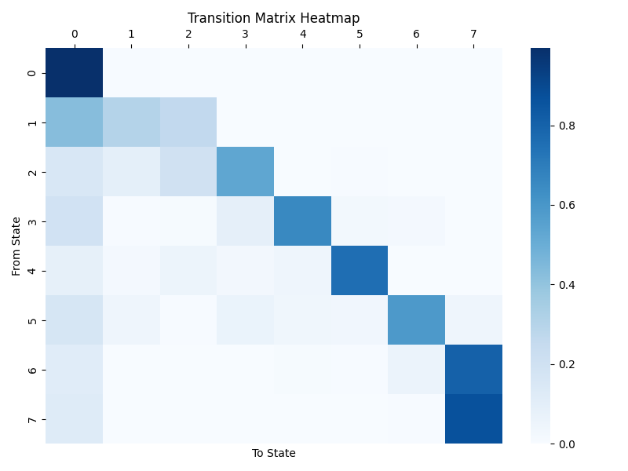
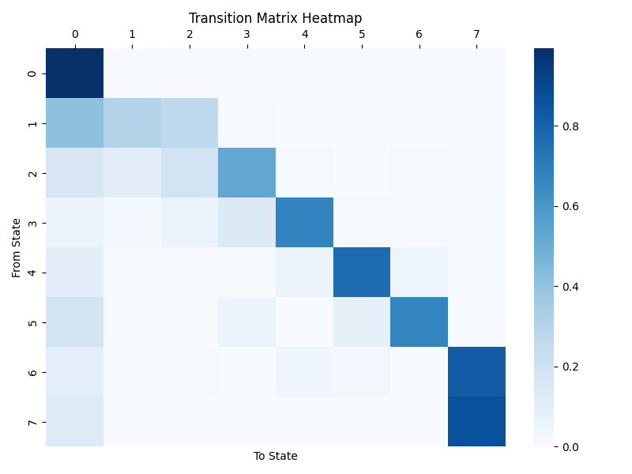
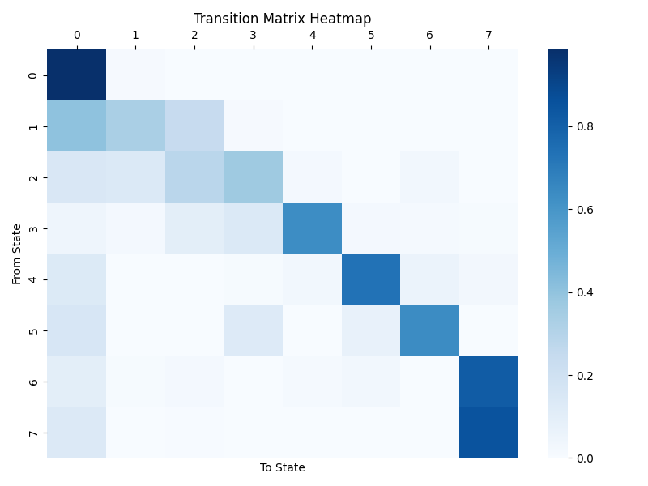
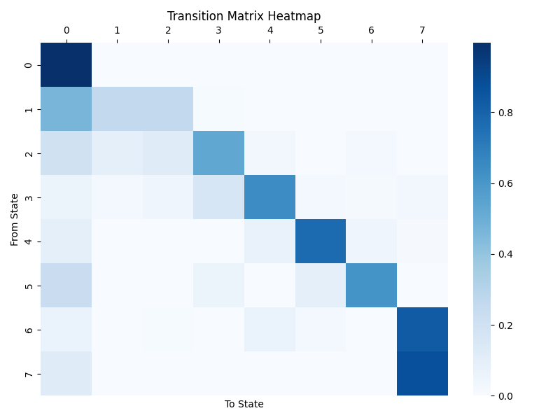

## MLP Report（Week 5）
The following is examinations on data of 2020Q1.  
Here state(class) 7 means delinquency state of higher than 6 months.  
_Data volumn is added to **500000** for alignment from now._

### Parametre Setting  
```python
# reclassify deliquency status
# clustered to the rest class(n+) if frequency accumulated to threshold
threshold = 0.995

# relabel credit score
df["Credit Score"] = df["Credit Score"].apply(lambda x: 0 if x <= 700 else 1)
```
```python
mlp = MLPClassifier(hidden_layer_sizes = (10, 10, 10), activation = 'relu', max_iter = 5000, random_state = 1, learning_rate_init = 0.0001, learning_rate = 'adaptive')
```

### MLP with only 'Previous Deliquency Status'
**transition matrix**  
[[9.94022382e-01 5.91521145e-03 3.53646655e-05 1.65107880e-05 1.52347455e-06 3.90762043e-12 9.00726338e-06 6.42965974e-12]  
 [4.29968070e-01 3.04129887e-01 2.63430149e-01 1.16433425e-03 9.65682209e-05 1.13860951e-03 7.23276223e-05 5.46326123e-08]  
 [1.59101852e-01 9.61874368e-02 1.99423758e-01 5.35428959e-01 2.98161966e-03 4.18574525e-03 2.68991327e-03 7.16357348e-07]  
 [1.90799217e-01 4.12130835e-03 8.72337102e-03 9.26175642e-02 6.55340713e-01 2.62664009e-02 2.11928704e-02 9.38554720e-04]  
 [8.74477619e-02 2.12788311e-02 5.55825813e-02 3.02593629e-02 4.83112171e-02 7.55418136e-01 1.57560624e-03 1.26503425e-04]  
 [1.66481742e-01 4.93420972e-02 6.58605048e-03 6.58269185e-02 4.05227218e-02 3.65501338e-02 5.88432013e-01 4.62583229e-02]  
 [1.14996044e-01 3.52477123e-03 2.63427799e-04 1.88527814e-03 8.82535338e-03 4.63159975e-03 6.10542163e-02 8.04819309e-01]  
 [1.25505362e-01 1.68915453e-04 1.62949988e-06 2.20215520e-05 1.91204341e-04 1.53606912e-05 5.26767766e-03 8.68827829e-01]]


**average probability = 0.5646595842821458**  
Probability of truly predicting class 0 is 0.9906949606952459  
Probability of truly predicting class 1 is 0.09058384986135457  
Probability of truly predicting class 2 is 0.24479073779037797  
Probability of truly predicting class 3 is 0.4618508911199944  
Probability of truly predicting class 4 is 0.5709482540755463  
Probability of truly predicting class 5 is 0.7397531600611733  
Probability of truly predicting class 6 is 0.5719197904238215  
Probability of truly predicting class 7 is 0.8467350302296532  

**brier score =  0.0212103697713376**  
Brier score for state 0 is 0.008971940392926118  
Brier score for state 1 is 0.007354259839925652  
Brier score for state 2 is 0.0021244604544810664  
Brier score for state 3 is 0.0009008098940400641  
Brier score for state 4 is 0.0005279990404296202  
Brier score for state 5 is 0.00031970478263967955  
Brier score for state 6 is 0.00029700065555969443  
Brier score for state 7 is 0.0007141947113357033  

### MLP with also `Credit Score`
**transition matrix**  
[[9.95047585e-01 4.90737658e-03 4.27363606e-05 2.07489406e-06 1.90226112e-10 1.88482031e-07 1.72891125e-08 2.12676897e-08]  
 [4.34902407e-01 2.90623138e-01 2.65008899e-01 6.11232597e-03 9.38133146e-05 2.08662908e-03 4.20362049e-04 7.52425415e-04]  
 [1.41536016e-01 1.13674411e-01 1.89687558e-01 5.37729944e-01 3.17133891e-03 2.30013934e-03 1.14492829e-02 4.51308922e-04]  
 [1.16385673e-01 4.78865710e-03 7.27920090e-03 1.15844962e-01 7.28709208e-01 6.15194065e-04 2.43690225e-02 2.00808285e-03]  
 [1.65544127e-01 5.20959387e-03 2.93208197e-02 1.48324279e-02 1.40212416e-02 7.34519179e-01 2.72392609e-02 9.31334953e-03]  
 [1.78490945e-01 3.58105591e-03 2.79027961e-02 4.38076830e-02 3.55247240e-02 7.16355896e-02 6.39057001e-01 2.05309370e-07]  
 [9.28229774e-02 8.68367003e-03 2.51236951e-02 1.82251434e-02 2.77808973e-02 3.38230006e-02 2.51603100e-04 7.93289013e-01]  
 [1.29494457e-01 3.92415740e-03 4.29124942e-03 4.73980647e-04 9.76489391e-04 1.30023313e-04 4.86196214e-07 8.60709156e-01]]  


**average probability = 0.5792166247445898**  
Probability of truly predicting class 0 is 0.9914236849857416  
Probability of truly predicting class 1 is 0.08949801394345165  
Probability of truly predicting class 2 is 0.24800217831361326  
Probability of truly predicting class 3 is 0.4744340618151356  
Probability of truly predicting class 4 is 0.5753527166628497  
Probability of truly predicting class 5 is 0.7528810368983833  
Probability of truly predicting class 6 is 0.6467992795010082  
Probability of truly predicting class 7 is 0.8553420258365351  

**brier score =  0.02115816506891893**  
Brier score for state 0 is 0.00896251921771285  
Brier score for state 1 is 0.007324184955299592  
Brier score for state 2 is 0.002119494691205232  
Brier score for state 3 is 0.0008923010351237158  
Brier score for state 4 is 0.0005377736024357184  
Brier score for state 5 is 0.00032175626383579086  
Brier score for state 6 is 0.0002893907592798636  
Brier score for state 7 is 0.0007107445440261659  

#### After relabelling Credit Score
**transition matrix**  
[[9.93755645e-01 6.18381057e-03 5.09668653e-05 1.80389718e-07 7.70106365e-12 7.07812008e-08 9.32616781e-06 9.37033474e-11]  
 [4.11599440e-01 3.04866550e-01 2.74205118e-01 6.91833161e-03 1.28460230e-03 7.03148665e-05 1.63368666e-04 8.92275219e-04]  
 [1.52066472e-01 1.08630015e-01 1.84316365e-01 5.24072288e-01 1.83254445e-02 1.18304950e-04 1.24659393e-02 5.17077320e-06]  
 [5.85115976e-02 2.33033413e-02 6.56961380e-02 1.35151029e-01 6.77053257e-01 1.92322681e-02 1.20213908e-02 9.03097723e-03]  
 [1.05087437e-01 1.17867451e-04 1.05425397e-04 1.45235755e-03 6.14056303e-02 7.62756914e-01 5.27338604e-02 1.63405084e-02]  
 [1.82051545e-01 1.12702228e-04 4.45921373e-05 5.44617097e-02 2.31361462e-03 8.76756342e-02 6.73340084e-01 1.18033211e-07]  
 [1.04758599e-01 3.27725600e-03 6.55221188e-03 1.53571536e-04 3.71009327e-02 2.89566266e-02 8.25851321e-05 8.19118217e-01]  
 [1.25029544e-01 1.23328193e-03 2.20919735e-03 1.73319912e-06 5.52517502e-04 1.80252530e-03 8.52945149e-07 8.69170348e-01]]  
  
Compared to previous 2 heatmaps, TM is more clustered in the diagnose.

**Transition Matrix for credit 0**  
[[9.85089908e-01 1.47502647e-02 1.39722599e-04 3.37180092e-06 7.59187814e-15 2.46387679e-07 1.64862978e-05 5.88991238e-14]  
 [4.05742706e-01 3.31699686e-01 2.46098307e-01 1.36765768e-02 6.19591574e-04 5.50474493e-04 5.76744588e-04 1.03591395e-03]  
 [1.51030563e-01 1.41207116e-01 2.83688967e-01 3.68514979e-01 2.21645415e-02 1.39981704e-03 3.19651152e-02 2.89018043e-05]  
 [4.96652646e-02 2.23965936e-02 1.02406204e-01 1.41274919e-01 6.34792600e-01 2.13158718e-02 1.89325348e-02 9.21601280e-03]  
 [1.32421121e-01 4.10618084e-04 9.78102042e-04 1.03708535e-02 3.17542345e-02 7.33981244e-01 5.94370773e-02 3.06467489e-02]  
 [1.58167254e-01 3.69832426e-04 6.90437716e-04 1.27562927e-01 1.09043060e-03 7.46408071e-02 6.37478274e-01 3.70670444e-08]  
 [1.02865227e-01 8.28595106e-03 2.15013017e-02 1.36663766e-03 1.56722832e-02 3.29255497e-02 1.33704616e-04 8.17249345e-01]  
 [1.35976528e-01 3.60877651e-03 6.23638416e-03 2.99914699e-05 5.51771987e-05 3.44929659e-03 1.29792705e-06 8.50642548e-01]]  
  

**Transition Matrix for credit 1**  
[[9.96224818e-01 3.74834007e-03 2.60327209e-05 3.25745504e-07 2.57270729e-11 3.50564036e-10 4.83509323e-07 5.17540747e-11]  
 [4.66131604e-01 2.58595175e-01 2.61136781e-01 9.20430364e-03 2.46539619e-03 2.29337083e-05 1.51471104e-04 2.29233480e-03]  
 [1.95617323e-01 9.66431782e-02 1.19891337e-01 5.31992376e-01 3.25144661e-02 2.22639753e-04 2.30792704e-02 3.94099443e-05]  
 [5.97147588e-02 1.96190883e-02 4.80677919e-02 1.61859692e-01 6.39034555e-01 2.69829017e-02 1.73014237e-02 2.74197889e-02]  
 [9.15210011e-02 8.44119128e-05 3.47053107e-04 3.15270671e-03 7.27913773e-02 7.72911541e-01 4.63389778e-02 1.28529314e-02]  
 [2.31407011e-01 2.00134247e-04 3.09143719e-04 5.80064240e-02 3.88273500e-03 9.42754301e-02 6.11918836e-01 2.85366085e-07]  
 [6.77990641e-02 1.35780666e-03 7.95617108e-03 6.44709219e-04 6.79062482e-02 2.43029537e-02 1.08769224e-04 8.29924278e-01]  
 [1.22665937e-01 3.20893470e-04 2.88608609e-03 2.18274599e-06 3.78015481e-04 2.54556831e-04 1.92200508e-07 8.73492136e-01]]  
  

**average probability = 0.5721887739016299**  
Probability of truly predicting class 0 is 0.9901889640780351  
Probability of truly predicting class 1 is 0.09392540634762463  
Probability of truly predicting class 2 is 0.25587888583117097  
Probability of truly predicting class 3 is 0.49133749635299223  
Probability of truly predicting class 4 is 0.5567374810615824  
Probability of truly predicting class 5 is 0.7070187235333298  
Probability of truly predicting class 6 is 0.6306709445017364  
Probability of truly predicting class 7 is 0.8517522895065679  

**PTP for credit 0**  
Probability of truly predicting class 0 is 0.9768614586873363  
Probability of truly predicting class 1 is 0.11070852994318557  
Probability of truly predicting class 2 is 0.24711947579285046  
Probability of truly predicting class 3 is 0.3444809702491412  
Probability of truly predicting class 4 is 0.5636794336609825  
Probability of truly predicting class 5 is 0.7237593197495896  
Probability of truly predicting class 6 is 0.5275941953908344  
Probability of truly predicting class 7 is 0.8497067156852668  
average probability for credit 0 = 0.5429887623948983  

**PTP for credit 1**  
Probability of truly predicting class 0 is 0.9934790858404252  
Probability of truly predicting class 1 is 0.07425062137738056  
Probability of truly predicting class 2 is 0.2313513297635816  
Probability of truly predicting class 3 is 0.46976918980209237  
Probability of truly predicting class 4 is 0.4828024198295161  
Probability of truly predicting class 5 is 0.700477872147146  
Probability of truly predicting class 6 is 0.640655329010256  
Probability of truly predicting class 7 is 0.8694424106435925  
average probability for credit 1 = 0.5577785323017488  

**brier score =  0.021207271891365342**  
Brier score for state 0 is 0.00898266041276095  
Brier score for state 1 is 0.007347500511825636  
Brier score for state 2 is 0.0021272615686340752  
Brier score for state 3 is 0.000893883816809593  
Brier score for state 4 is 0.0005316786331618528  
Brier score for state 5 is 0.0003200049037122438  
Brier score for state 6 is 0.0002928417604225396  
Brier score for state 7 is 0.000711440284038449  

### MLP with other five main features
```python
["Credit Score", "Original UPB", "Original Debt-to-Income (DTI) Ratio", "Original Loan-to-Value (LTV)", "Original Interest Rate"]
```
**transition matrix**  
[[9.94226255e-01 5.73558792e-03 1.93409729e-05 8.85140557e-07 1.98225871e-06 4.33553909e-11 1.59475232e-05 1.07971890e-09]  
 [4.31707925e-01 2.94934572e-01 2.67449416e-01 4.47796133e-03 8.63124902e-04 1.50496686e-08 4.75152784e-06 5.62234301e-04]  
 [1.51682648e-01 1.18842370e-01 1.74857437e-01 5.38382725e-01 1.06384392e-02 7.09393535e-06 5.85249198e-06 5.58343426e-03]  
 [1.11480468e-01 4.35569300e-02 2.94512319e-02 1.31987502e-01 6.69576225e-01 4.85788069e-04 1.32217568e-02 2.40098319e-04]  
 [6.82927896e-02 6.11561336e-04 3.38238202e-04 2.00373300e-02 1.56376732e-02 7.71159639e-01 7.34509748e-02 5.04717939e-02]  
 [1.90814627e-01 5.29761017e-04 1.45667221e-04 8.55397599e-04 5.57249442e-02 9.22639128e-02 6.59427307e-01 2.38382797e-04]  
 [1.35912960e-01 7.37084088e-03 6.35722186e-03 3.20304919e-03 3.36536214e-04 5.12819454e-02 1.93959102e-03 7.93597856e-01]  
 [1.14809821e-01 4.44898369e-03 4.04593358e-03 9.81438641e-04 1.91270833e-06 9.63995479e-04 7.73640413e-06 8.74740178e-01]]  


**average probability = 0.5767204344078332**  
Probability of truly predicting class 0 is 0.9905541201083669  
Probability of truly predicting class 1 is 0.0900952316483907  
Probability of truly predicting class 2 is 0.25461444221525376  
Probability of truly predicting class 3 is 0.48286748116691597  
Probability of truly predicting class 4 is 0.5720632742502564  
Probability of truly predicting class 5 is 0.7242598747138388  
Probability of truly predicting class 6 is 0.6338587216182541  
Probability of truly predicting class 7 is 0.8654503295413887  

**brier score =  0.021230246543668608**  
Brier score for state 0 is 0.008946590504328767  
Brier score for state 1 is 0.007368248910457557  
Brier score for state 2 is 0.0020834933577912004  
Brier score for state 3 is 0.0008926066098393566  
Brier score for state 4 is 0.0005461769749695848  
Brier score for state 5 is 0.00034997860223982114  
Brier score for state 6 is 0.0003135047161063727  
Brier score for state 7 is 0.0007296468679359476  

#### _Authored by Peini SHE on Apr.10, 2025_